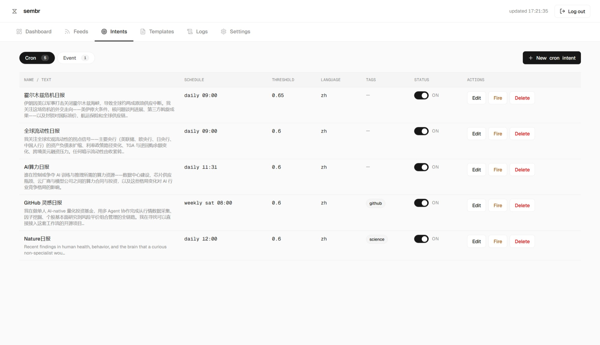
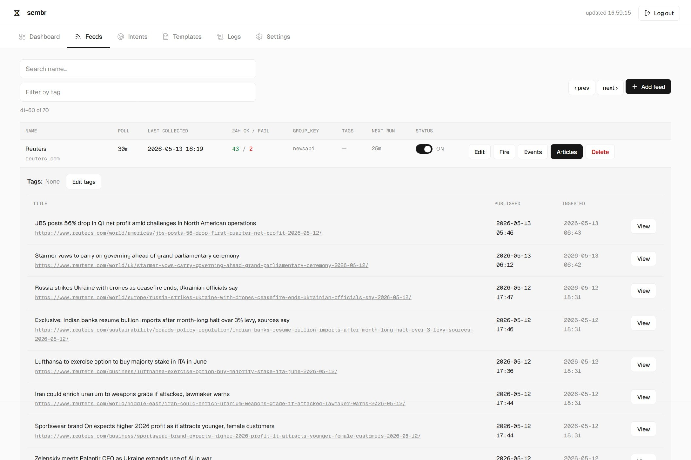
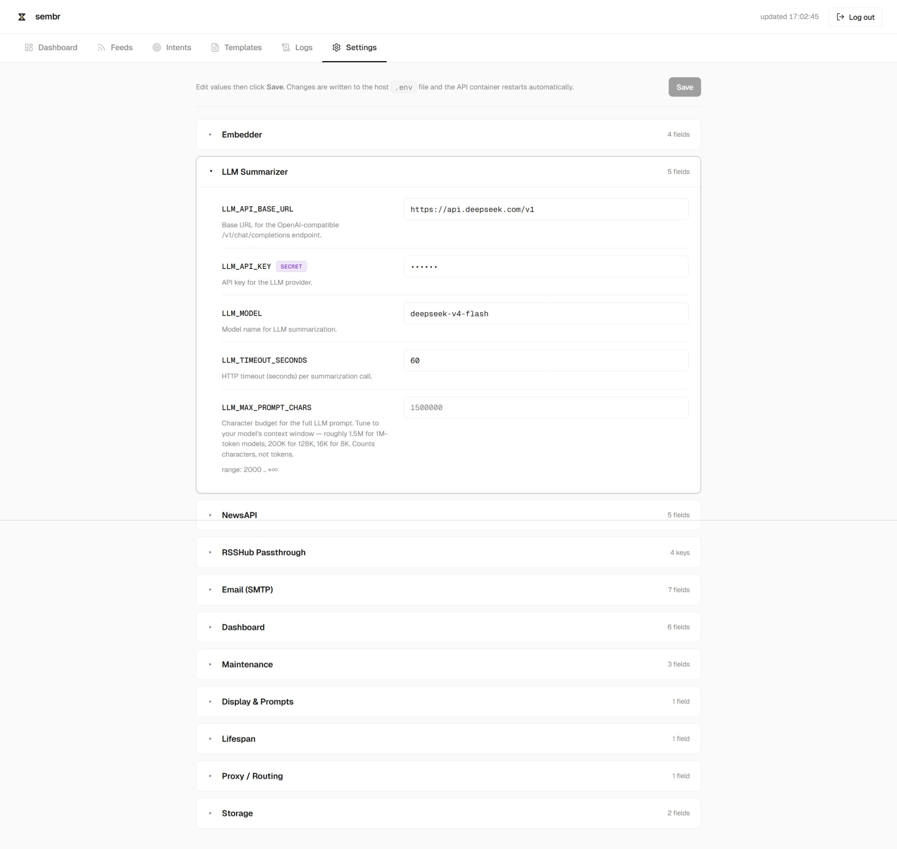

<p align="center">
  
</p>

<p align="center">
  <b>Your private intelligence analyst.</b><br>
  <i>Say what to watch — and how to analyze it. sembr scans your chosen feeds continuously, matches by meaning (not keywords), and delivers analyst-shaped digests on your terms.</i>
</p>

<p align="center">
  <a href="https://github.com/Peakstone-Labs/sembr/actions/workflows/ci.yml"></a>
  <a href="LICENSE"></a>
  <a href="pyproject.toml"></a>
  <a href="Dockerfile"></a>
  <a href="https://panel.peakstone-labs.com/static/img/sembr-preview-qrcode.png"></a>
</p>

<p align="center">
  <a href="https://panel.peakstone-labs.com/#news"><b>Live demo</b></a> ·
  <a href="README.zh-CN.md">中文</a> ·
  <a href="https://peakstone-labs.github.io/sembr">Documentation</a> ·
  <a href="#alternatives-and-why-sembr-exists">Alternatives</a> ·
  <a href="#quickstart">Quickstart</a> ·
  <a href="#for-ai-agents">For AI agents</a> ·
  <a href="https://github.com/Peakstone-Labs/sembr/discussions">Discussions</a>
</p>

---

**sembr** is a **self-hosted intent radar**. You describe what you care about once — _"monitor Fed policy impact on emerging-market currencies"_ — and it continuously scans RSS feeds, news APIs, and social streams, matches articles to your intent via semantic vectors, and generates reports through the analytical lens you configure.

<p align="center">
  
  <br>
  <sub><i>Live demo: sembr powers the News tab inside <a href="https://panel.peakstone-labs.com">Peakstone Labs' A股 panel</a>.</i></sub>
</p>

<!-- TODO: add product UI strip (intent editor / dashboard / digest email) once captured -->

## Why sembr

- **Semantic, not keyword.** Your intent is an embedding, not an `OR`-list. *"EM currency contagion"* matches *"Turkish lira plunges as Fed eyes another hike"* with zero shared words.
- **Bilingual out of the box.** [BGE-M3](https://huggingface.co/BAAI/bge-m3) was picked specifically for CJK + English mixed content. Write your intent in one language; mixed-language sources — Bloomberg, Reuters, Nature, 财联社, 华尔街见闻, 36氪 — all match against it.
- **Per-intent analyst lens.** Each intent can bind its own analyst template (system + instruction, edited from the dashboard). The same article — under *"macro asset allocator"* outputs cross-asset rotation signals and rebalancing setups; under *"short-term commodity desk"* outputs supply-demand pivots and near-term catalysts — sembr isn't just *finding* matches, it's *analyzing them your way*. Templates are highly customizable; more bundled ones landing post-1.0.
- **Free embeddings, pennies per digest.** The default embedder (BGE-M3 on [SiliconFlow](https://siliconflow.cn)) is free at any volume. The default LLM (DeepSeek-V4-Flash) is per-token (**input $0.14 / output $0.28 per 1M tokens**). A typical daily digest — dozens of full articles in plus the analysis out — usually runs around a cent. OpenAI-compatible protocol means you can swap to OpenAI / Together / Groq / Ollama / mlx-lm any time.
- **Data sovereignty stays with you.** Your intents and match history live in local Qdrant — no third party sees them. The default embedder + LLM hit cloud APIs (SiliconFlow / DeepSeek) for zero-friction startup, but both are ABC seams — swap in Ollama / mlx-lm and the data never leaves the box.
- **Cron or event.** Per-intent schedule: a fixed digest time (*"every weekday 09:00 in Asia/Shanghai"*) or event-mode (*"fire when something moves"*).
- **Pluggable everywhere.** Source / channel / embedder / LLM are all ABC seams. Telegram, Discord, Slack channels, local LLM backends (mlx-lm, Ollama), and more source plugins (Reddit, HN, Mastodon) are scaffolded for post-1.0.
- **Agent-friendly by design.** One-shot install by an AI agent, Agent Skills integration, and a synchronous fire endpoint built for orchestrators. See [For AI agents](#for-ai-agents).

## How "Reverse RAG" works

> *Attention is all you need.* — Vaswani et al., 2017
>
> *AI is your attention.* — sembr

Classic RAG: user types a query → app retrieves matching documents → LLM answers.

**Reverse RAG (sembr):** user defines an intent → sembr embeds it once → every new article runs against every standing intent vector → matches get summarized and pushed.

The flip is small but its implications are big. Queries become first-class entities you can name, edit, schedule, and version. Retrieval becomes a long-running job, not a request-response round-trip. *"Answer quality"* becomes *"how relevant were the last 10 things I was told about."*

<p align="center">
  
  <br>
  <sub>Five live intents from a working deployment. Each is a natural-language brief; the cron preset + threshold + tags fully define the matcher's behaviour. Live digests at <a href="https://panel.peakstone-labs.com/#news">panel.peakstone-labs.com</a>.</sub>
</p>

→ Full architecture write-up: [docs/architecture.md](docs/architecture.md)

## Alternatives, and why sembr exists

How the closest tools in the market compare on the dimensions that matter for sembr's use case:

| | Price | Semantic | Custom sources | Self-host | Bilingual CN+EN | Per-intent lens | Agent API |
| --- | :---: | :---: | :---: | :---: | :---: | :---: | :---: |
| **Feedly Pro+ AI** | ~$99 / yr | ✅ | ⚠️ ¹ | ❌ | ⚠️ ² | ⚠️ ³ | ❌ |
| **Inoreader Pro** | $90 / yr | ❌ | ✅ | ❌ | ⚠️ | ⚠️ ⁴ | ⚠️ |
| **Brand24 / Mention** | $199–$499 / mo | ❌ | ❌ ⁵ | ❌ | ⚠️ | ❌ | ✅ |
| **Bloomberg Terminal** | ~$32k / yr / seat | ✅ ⁶ | ❌ | ❌ | ✅ | ❌ | ⚠️ ⁷ |
| **FreshRSS / miniflux** | $0 (self-host) | ❌ | ✅ | ✅ | ❌ | ❌ | ⚠️ |
| **Google Alerts** | $0 | ❌ | ❌ | ❌ | ❌ | ❌ | ❌ |
| **Perplexity Pro** | $20 / mo | ✅ | ❌ | ❌ | ⚠️ | ⚠️ ⁸ | ✅ |
| **sembr** | **Self-host + ~$0.014 / intent / day** | ✅ | ✅ | ✅ | ✅ | ✅ | ✅ |

✅ comparable to sembr or better · ⚠️ partial / with caveats · ❌ not supported

<sub>
¹ Limited to Feedly's curated index — you don't point it at arbitrary RSS / NewsAPI.<br>
² Translates non-English articles to English first; not native cross-lingual vectors.<br>
³ Natural-language filter, not a per-feed system+instruction prompt template.<br>
⁴ On-demand custom queries per article (GPT-4o-mini, 1M tokens / month); not a standing per-intent prompt.<br>
⁵ Vendor scans the public web for you; you don't get to point it at specific sources.<br>
⁶ ASKB conversational AI (beta in 2026); proprietary, terminal-only.<br>
⁷ B-Pipe data licensing priced separately (institutional only).<br>
⁸ Spaces persistent custom instructions are real, but apply per-query (pull); sembr applies them push-style on every match.
</sub>

**DIY paths** — n8n / Huginn + LangChain + a vector DB + your own scheduler — could check ✅ on every column above. You'd be assembling 5+ moving parts and owning the long tail of feed parsing, embedding rate-limits, dedup, prompt management, and notification reliability yourself. sembr is the turnkey version of that stack.

If you're an institution with budget, run Bloomberg or Brand24. If you're happy with a hosted plan and your watchlist isn't sensitive, Feedly Pro+ is great. sembr is for the slice where you want all four of **semantic + bilingual + custom sources + self-host** at once, **and** the per-intent analyst lens applied push-style on every match. **No tool we've found today sits at that intersection.**

### "What if I just wrap Perplexity's API in a cron loop?"

The table above covers head-to-head capabilities. The "wrap the API in a script" alternative is the one place readers most often think they can DIY past sembr. You can, for one or two low-frequency topics. Three structural gaps don't go away if you try at scale:

1. **Cost shape** — every poll costs ~$0.005–0.02 vs sembr's "free until matched". 10 intents × 24 polls/day × 365 days ≈ 87k API calls; the math gets ugly fast.
2. **Matching quality** — you'd hand-craft search queries every time, instead of writing one natural-language intent that BGE-M3 vectorises once. *"EM contagion"* won't return *"Turkish lira plunges as Fed eyes another hike"* through keyword ranking; semantic vectors do.
3. **Watchlist leak** — every poll mails what you're monitoring to a third party. *What you're watching is itself signal* — sembr keeps it on your hardware.

## Quickstart

**Got an AI coding agent on this machine?** Jump to [For AI agents](#for-ai-agents) below — one-shot install + an Agent Skills bundle for the post-install API.

**Manual install** (everything below, ~15 min). Requires Docker + Docker Compose. First run pulls Qdrant + RSSHub and builds the API image (Python 3.12 base + Docker CLI + pip wheels) — **about 1 GB total network download, 10–15 minutes on a typical home connection**. `/health` returns `503` until the embedder probe completes.

```bash
git clone https://github.com/Peakstone-Labs/sembr.git
cd sembr
cp .env.example .env                 # 1. seed config
# open .env, set EMBEDDER_API_KEY (free key at https://siliconflow.cn)
docker compose up --build            # 2. start everything

# in another shell, 1–2 minutes later:
curl -i http://localhost:8000/health         # 200 once embedder probe completes
open http://localhost:8000/dashboard          # web UI
```

Out of the box: 53 pre-loaded sources across RSS / NewsAPI / Twitter (EN + CN), a live dashboard, and a working `/intents` API. Create your first intent:

```bash
curl -X POST http://localhost:8000/intents \
  -H "Content-Type: application/json" \
  -d '{
    "name": "fed-emerging-markets",
    "text": "Fed policy impact on emerging-market currencies and capital flows",
    "timezone": "America/New_York",
    "schedule": {"mode": "cron", "preset": "daily", "hour": 8, "minute": 0},
    "channels": [{"type": "email", "to": ["you@example.com"]}]
  }'
```

Next digest fires on schedule. Done.

→ Step-by-step walkthrough: [docs/getting-started.md](docs/getting-started.md)
→ Putting sembr on a public IP? Read [docs/deployment/public.md](docs/deployment/public.md) first — TL;DR keep the default `127.0.0.1` bind, put sembr behind a reverse proxy with TLS, and set a strong `DASHBOARD_TOKEN`.

## What's in the box

**53 pre-loaded sources across three source types** — curated for substantive body text or information-dense headlines:

| Source type | Pre-loaded | Examples |
| --- | --- | --- |
| RSS feeds | 22 | The Guardian, SCMP, NPR, Washington Post, Bloomberg Markets, 华尔街见闻, 第一财经, 36氪, 虎嗅, 财联社电报, 澎湃, 国家统计局, Nature ×3, HelloGitHub |
| Twitter | 1 | Elon Musk — extend with your own users / keyword searches via a `TWITTER_AUTH_TOKEN` cookie |
| [NewsAPI.ai](https://newsapi.ai) aggregator | 30 | Reuters, BBC, NYT, WSJ, FT, Economist, Bloomberg, The Atlantic, NPR, TechCrunch, Wired, Ars Technica, Vox, … |

RSS routes that need a JS-rendering origin (most CN sources, Twitter) go through the bundled **[RSSHub](https://rsshub.app)** sidecar — no extra setup. NewsAPI.ai's free signup token covers roughly 30 days of normal polling; get one at [newsapi.ai](https://newsapi.ai) and drop it into `.env`. Full per-feed list: [docs/getting-started.md](docs/getting-started.md).

Want **WeChat Official Accounts (微信公众号)**? They have no official feed API, but you can self-host a third-party bridge as an optional add-on — see [docs/deployment/wechat-official-accounts.md](docs/deployment/wechat-official-accounts.md).

<p align="center">
  
  <br>
  <sub>Feeds tab. Each row is a live source; expand to inspect the most recent ingests with their source URLs and timestamps.</sub>
</p>

- **BGE-M3 embeddings** via SiliconFlow (free), or any OpenAI-compatible `/v1/embeddings` endpoint
- **[Qdrant](https://qdrant.tech) vector store** with scalar int8 quantization (10M vectors fit in ~600 MB RAM)
- **LLM digest generation** via any OpenAI-compatible `/v1/chat/completions` — defaults to DeepSeek-V4-Flash on SiliconFlow
- **Email delivery** (SMTP, multipart/related, per-intent timezone, matcher-score badges)
- **Monitoring dashboard**: live feed health, embedder latency, container CPU / mem / uptime, Qdrant article browser with date / source / title filters, log SSE, one-click restart
- **Runtime settings editor** that writes the host `.env` and recreates the affected containers in place — you can do everything from the UI
- **Custom prompt templates** — system + instruction, with strict-placeholder validation and dashboard CRUD

→ Module-by-module deep dives: [docs/modules/](docs/modules/index.md)

## Configuration

`pydantic-settings` with a four-level precedence chain (highest wins):

1. Shell env vars
2. `.env` file (project root)
3. `sembr.yaml` (project root)
4. Built-in defaults

Sensitive values (`EMBEDDER_API_KEY`, `LLM_API_KEY`, `DASHBOARD_TOKEN`, SMTP creds) belong in env vars or a properly-permissioned `.env` — never in committed files. Full surface: [docs/configuration.md](docs/configuration.md).

> ⚠️ **Set `DASHBOARD_TOKEN` whenever the host is reachable beyond `localhost`.** Without it, `/api/dashboard/*` and the settings editor are unauthenticated. The Settings editor also bind-mounts the host docker socket so it can recreate containers — that's a deliberate single-tenant trade-off (same model as Watchtower / Portainer); anyone with API access is effectively docker-root on the host. Don't run sembr on a multi-tenant host without accepting that. See [docs/deployment/public.md](docs/deployment/public.md) for the full hardening checklist.

<p align="center">
  
  <br>
  <sub>Settings tab. Edit the host <code>.env</code> in the browser; secret fields are masked; saves are dry-run validated, then a <code>RestartController</code> recreates the affected container in place.</sub>
</p>

## For AI agents

sembr is designed to be **installed**, **driven**, and **embedded** by AI coding agents. Three pieces of scaffolding ship in the repo:

### 1. One-shot install

If you have an AI coding agent with shell access on the target machine (Claude Code, Cursor, Cline, Aider, Continue, Roo, OpenClaw, Hermes, …), paste this:

> Read https://github.com/Peakstone-Labs/sembr/blob/main/agent/INSTALL.md and follow it to install sembr on this machine.

[`agent/INSTALL.md`](agent/INSTALL.md) is a 6-phase script the agent works through: hardware self-check → Docker setup → repo clone → key validation → access-mode choice (localhost / LAN / public) → bring up → first health round-trip. Image pulls run in the background while it asks you for API keys in parallel, so wall-clock is ~15 min of which ~10 are unattended.

For public-internet deployment the agent branches into [`agent/PUBLIC_INSTALL.md`](agent/PUBLIC_INSTALL.md) — DNS check, mandatory side-service port lockdown (qdrant/rsshub), reverse proxy + TLS via Caddy / nginx + certbot / Cloudflare Tunnel / trycloudflare, ufw, and an explicit docker.sock decision — then returns to Phase 5 to bring the stack up and run external verification.

### 2. Skill bundle for post-install operation

Once sembr is running, [`agent/sembr/`](agent/sembr/) is an [Agent Skills](https://agentskills.io) bundle that teaches any agent how to drive the HTTP API:

| File | Content |
| --- | --- |
| `SKILL.md` | Auth model, decision matrix for which `fire` endpoint to use, guardrails |
| `references/endpoints.md` | Full surface — 31 endpoints across feeds / intents / fire / external-fire / settings / prompts / translate |
| `references/schemas.md` | `IntentCreate` / `FeedCreate` / `ExternalFireRequest` body shapes, including the cron/event discriminated union and channel discriminator |
| `references/recipes.md` | Copy-pasteable curl + Python `httpx` workflows |
| `references/errors.md` | Status code table and scrubbed-detail error contract |

**Claude Code**: `cp -r agent/sembr ~/.claude/skills/sembr` for auto-loading. **Other platforms**: hand your agent `agent/sembr/SKILL.md` directly, or consult your platform's skill-loading docs.

### 3. The agent-callable fire endpoint

`POST /api/external/intents/{id}/fire` is the orchestrator-facing diagnostic endpoint:

- **Synchronous** — matches + LLM summary in the response, no polling, no `task_id` hand-off
- **No notifier** — the intent's email recipients are not pinged; safe for "what would this intent match right now?" without spamming
- **No state writes** — doesn't touch `match_seen`, idempotent under repeated calls
- **Per-call overrides** — `lookback_seconds` (`300`–`2_592_000`), `threshold` (`0.20`–`0.95`, wider than the `0.60`–`0.95` at intent-create time, so you can sweep low during diagnostics), `feed_ids` (subset or `null` for all)

Drop sembr into any orchestrator (Hermes, OpenClaw, LangGraph, your own) and let it decide when to look at the world. The response shape, error contract, rate-limit (1/intent/60 s), and the cron-mode-only constraint are documented in [`agent/sembr/references/endpoints.md`](agent/sembr/references/endpoints.md).

## Tech stack

Python 3.12 · FastAPI 0.115 · Pydantic v2 · APScheduler 3.11 · aiosqlite (WAL) · Qdrant 1.17 · httpx · BGE-M3 · DeepSeek-V4-Flash · Apache-2.0

Runs comfortably on **4 GB RAM** (homelab / Mac mini / NAS / $10 VPS) — measured baseline is ~1 GB across the three containers at the default 53-source workload. Scale up `qdrant.mem_limit` to 4G+ if you ingest at the millions-of-articles tier.

## Status

**v1.0** — first stable release. Ships RSS ingestion, BGE-M3 embeddings, Qdrant dual-collection, intent CRUD (cron + event), LLM-summarized digests, email channel, monitoring dashboard, runtime settings editor, and a hardened public-deployment guide.

**Post-1.0:** Telegram / Discord / Slack channels, local LLM backends (mlx-lm, Ollama), Reddit / HN / Mastodon source plugins, entry-points plugin discovery, notification retry / DLQ, multi-worker deployment.

→ Versioning policy and changelog: [CHANGELOG.md](CHANGELOG.md)

## Built by

[Peakstone Labs](https://github.com/Peakstone-Labs) — AI-native quantitative research. sembr started as the news side of an internal alpha-research pipeline; opening it up makes it useful to a much wider set of people watching the same world we are.

If you have feedback, found a bug, or want a source / channel plugin: [Discussions](https://github.com/Peakstone-Labs/sembr/discussions) for ideas and questions, [Issues](https://github.com/Peakstone-Labs/sembr/issues) for bugs and concrete feature requests, [SECURITY.md](SECURITY.md) for vulnerability reports. Contributions welcome — see [CONTRIBUTING.md](CONTRIBUTING.md).

## License

[Apache-2.0](LICENSE). © 2025–2026 Peakstone Labs and sembr contributors.
